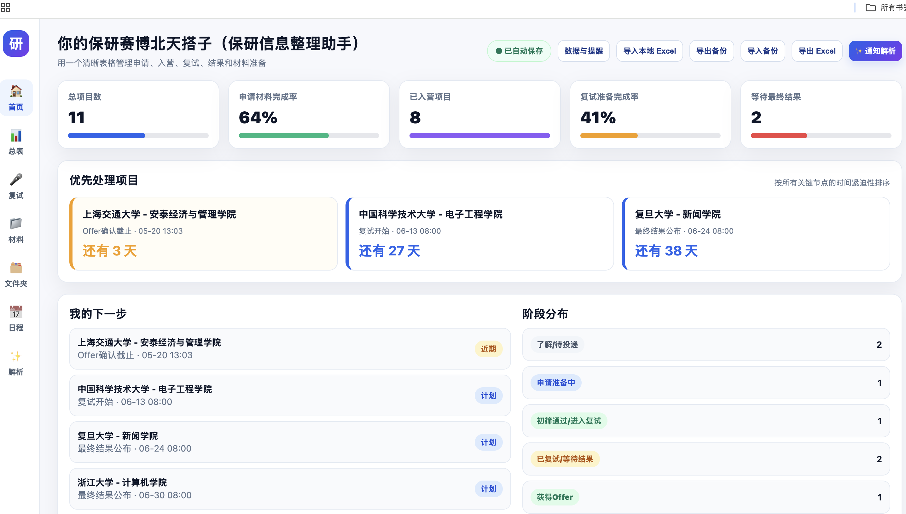
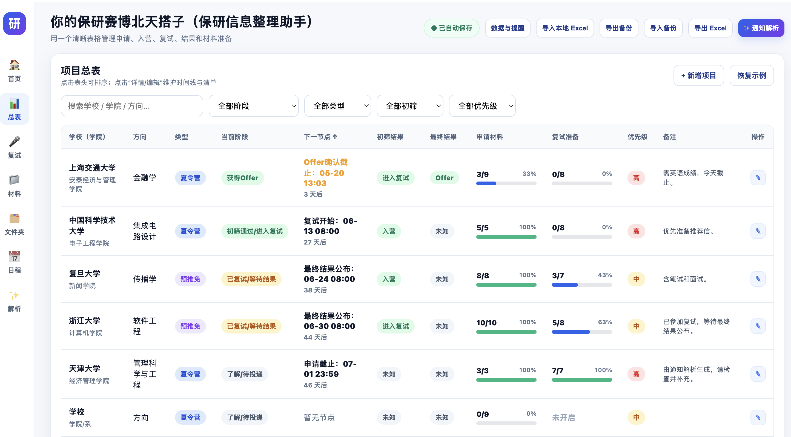
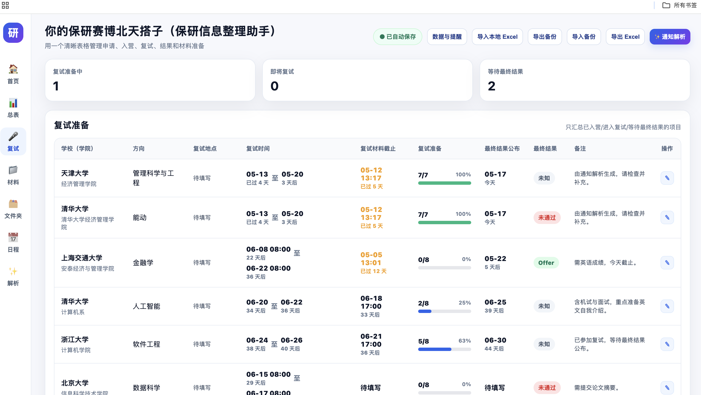
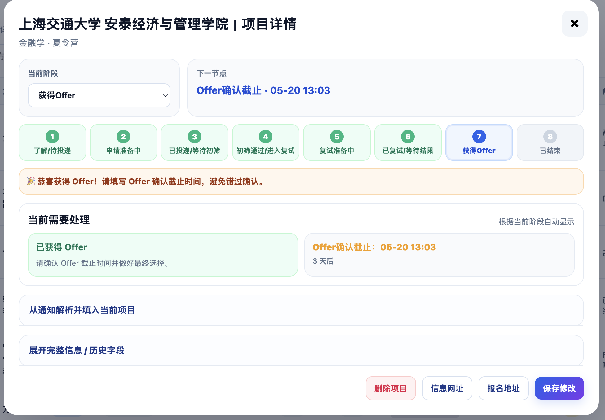
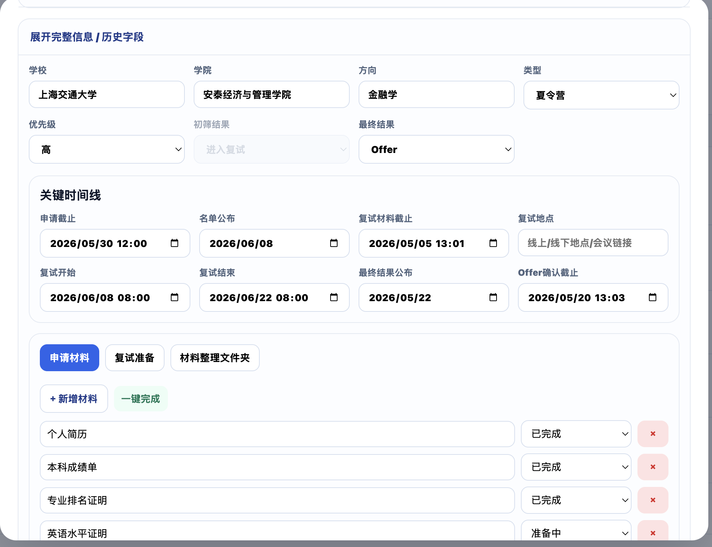
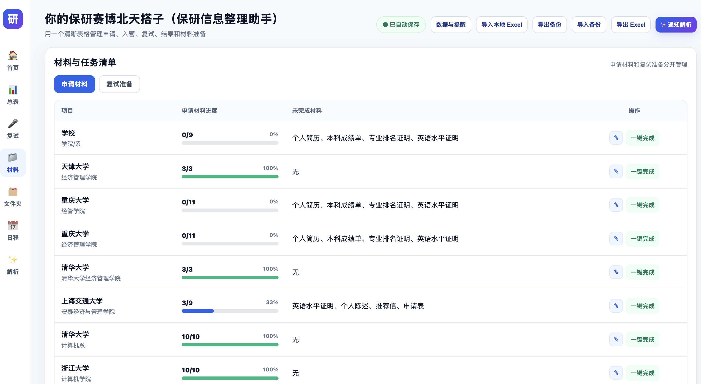
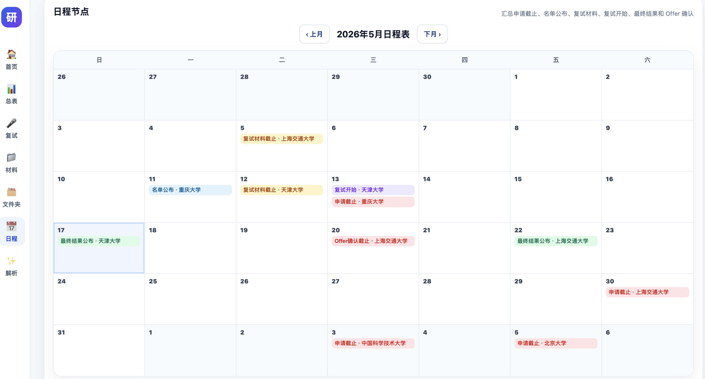
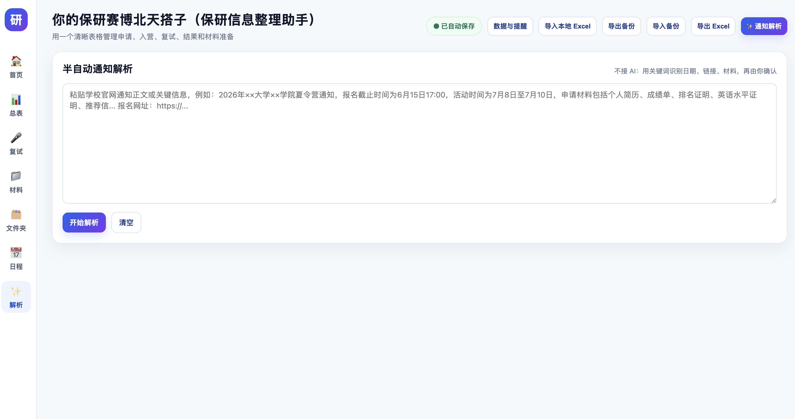
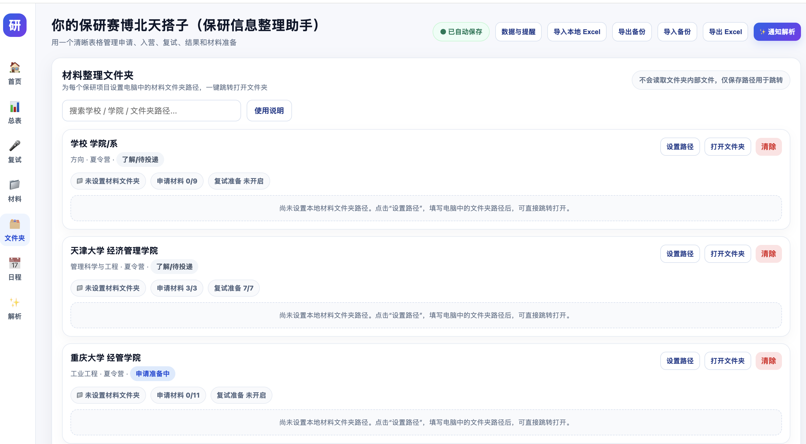

# 你的保研赛博北天搭子

一个面向保研申请季的本地网页助手，用来整理院校项目、申请材料、复试任务、关键日程、通知解析和备份数据。

项目是纯前端实现，不需要后端服务，也不需要安装依赖。直接用浏览器打开 `index.html` 即可使用。

## 预览



















## 功能

- 项目总表：管理学校、学院、方向、类型、阶段、优先级和备注。
- 智能阶段流：根据初筛结果、复试结果和 Offer 状态自动调整项目阶段。
- 材料清单：分别跟踪申请材料和复试准备任务。
- 日程看板：汇总申请截止、名单公布、复试材料截止、复试时间、最终结果和 Offer 确认。
- 通知解析：粘贴官网通知正文后，用规则识别学校、时间、链接和材料，并由用户确认。
- 本地文件夹路径：为每个项目保存材料文件夹路径，方便快速跳转或复制路径。
- 数据与提醒：本地自动保存、IndexedDB 镜像存储、备份提醒、浏览器通知。
- 导入导出：支持 JSON 备份、Excel/CSV 导入，以及 Excel 格式导出。

## 快速开始

1. 下载或克隆本仓库。
2. 用浏览器打开 `index.html`。
3. 点击“新增项目”开始维护你的申请计划。
4. 定期点击“导出备份”，保存一份 JSON 文件。

也可以使用任意静态文件服务器预览，例如：

```bash
python3 -m http.server 8000
```

然后访问 `http://localhost:8000`。

## 部署到 GitHub Pages

这个项目是静态网页，适合直接部署到 GitHub Pages。

1. 把项目上传到 GitHub 仓库。
2. 进入仓库的 `Settings`。
3. 找到 `Pages`。
4. 在 `Build and deployment` 中选择 `Deploy from a branch`。
5. 分支选择 `main`，目录选择 `/root`。
6. 保存后等待 GitHub 生成访问地址。

如果仓库名是 `cyber-baoyan-assistant`，部署地址通常类似：

```text
https://你的用户名.github.io/cyber-baoyan-assistant/
```

## 数据保存说明

本项目默认把数据保存在当前浏览器中：

- 主存储：`localStorage`
- 镜像存储：`IndexedDB`
- 手动备份：JSON 文件

浏览器数据不是永久保险箱。更换设备、清理浏览器缓存、切换浏览器或隐私模式，都可能导致看不到原数据。建议定期导出 JSON 备份。

详细说明见 [PRIVACY.md](PRIVACY.md)。

## 浏览器限制

由于这是纯前端网页，有一些天然限制：

- 不能在后台长期运行。提醒功能需要网页被打开。
- 浏览器通知需要用户授权，并受浏览器策略影响。
- 网页不能静默写入电脑任意文件夹，所以“自动备份”以提醒和一键导出为主。
- 本地文件夹功能只保存路径，不读取文件夹内容。

如果需要真正的后台提醒、自动写入本地备份文件、系统级文件管理，未来测评过程后，会更新迭代新版本升级为 Tauri 或 Electron 桌面应用。

## 适合谁

- 正在准备保研、夏令营、预推免或九推的学生。
- 想用一个本地工具管理申请进度，而不是把隐私数据放到云端表格的人。
- 想学习纯前端本地数据管理、表格导入导出和任务看板设计的开发者。

## 开发说明

当前项目没有构建流程，主要文件如下：

```text
index.html   页面结构
styles.css   页面样式
script.js    数据、交互、导入导出和通知逻辑
```

欢迎提交 Issue 或 Pull Request。优先改进这些方向：

- 更可靠的通知解析规则
- 移动端体验优化
- 多语言或自定义字段
- Tauri/Electron 桌面版
- 自动化测试

## 许可证

本项目使用 MIT License。
